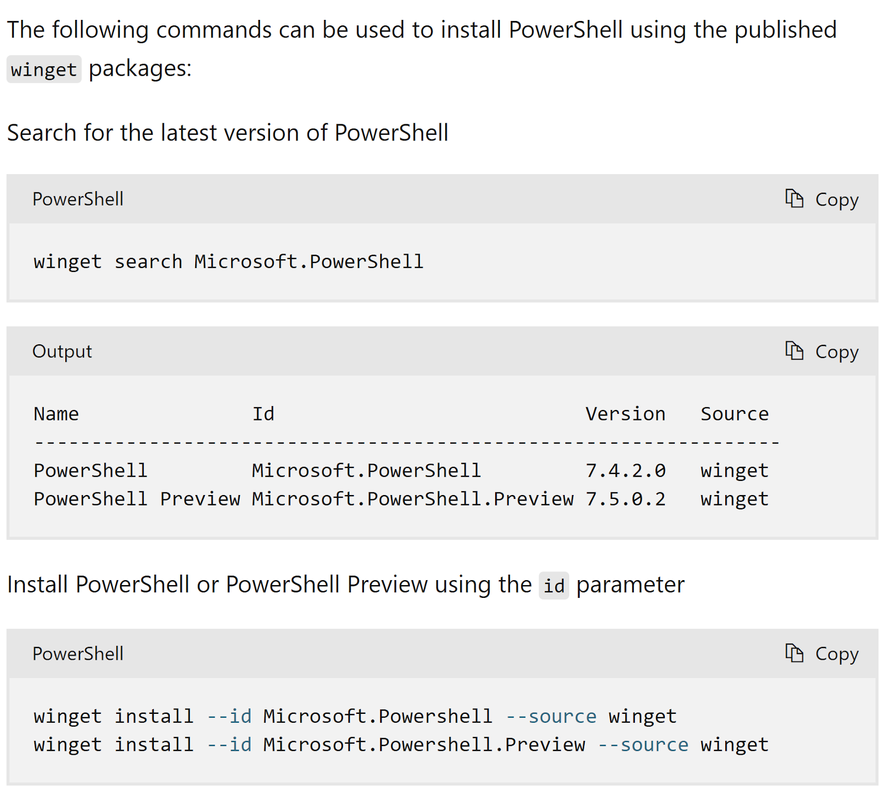
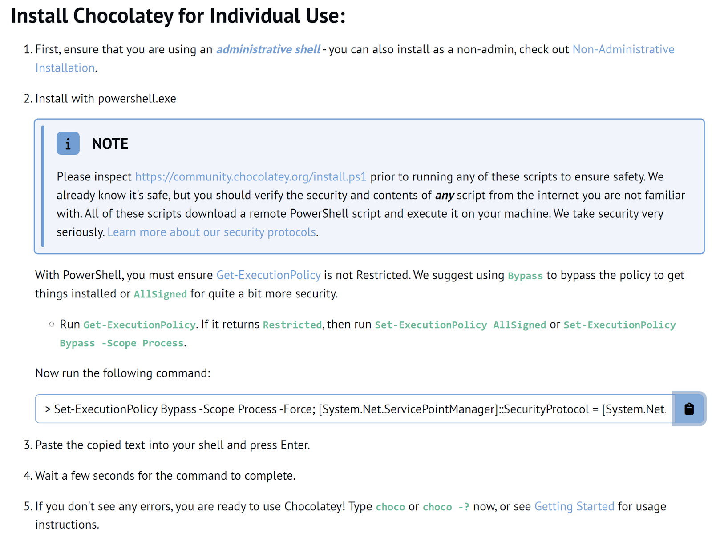
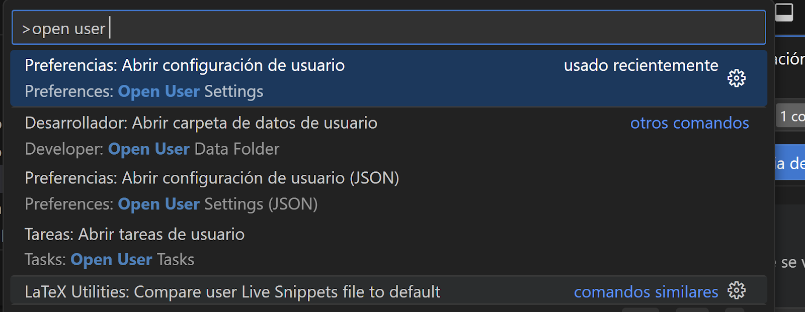
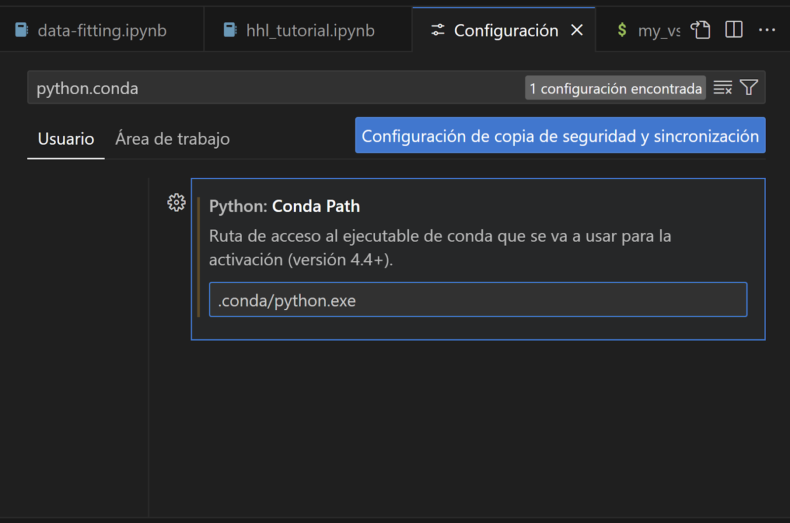
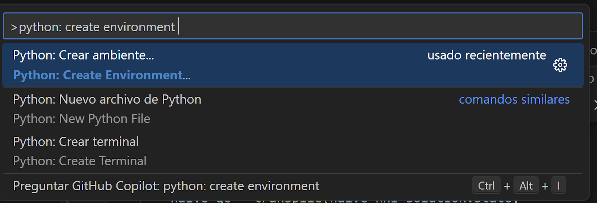

# Tutorial Introduction to Quantum Artificial Intelligence: quantum algorithms for linear systems of equations and data fitting

# Jara Juana Bermejo Vega

#  1 Table of Contents

# 1 Table of Contents

- [1 Table of Contents](#table-of-contents)
- [2 About](#about)
- [3 Preliminaries: setting up your computer](#preliminaries:-setting-up-your-computer)
  * [3.1 Linux](#linux)
  * [3.2 MacOS](#macos)
  * [3.3 Windows](#windows)
    + [3.3.1 Package Managers](#package-managers)
  * [3.4 Development environment Visual Studio Code](#development-environment-visual-studio-code)
    + [3.4.1 VS Code Command Palette](#vs-code-command-palette)
    + [3.4.2 Default Terminal](#default-terminal)
    + [3.4.3 VS Code Extensions](#vs-code-extensions)
  * [3.5 Python](#python)
    + [3.5.1 Anaconda (Miniconda)](#anaconda-(miniconda))
    + [3.5.2 Python Environments](#python-environments)
  * [3.6 Version control with Git](#version-control-with-git)
- [4 Quantum Linear Solvers on QisKit](#quantum-linear-solvers-on-qiskit)
  * [4.1 Setting up our Qiskit Environment](#setting-up-our-qiskit-environment)
  * [4.2 Installing Qiskit and Python packages](#installing-qiskit-and-python-packages)
    + [4.2.1 Installing QisKit](#installing-qiskit)
  * [4.3 Setting up IJupyter kernels](#setting-up-ijupyter-kernels)
- [5 Try the tutorials](#try-the-tutorials)


#  2 About

This repository contains materials used in a practical lecture for a course on Quantum Machine Learning and Artificial Intelligence, taught at the UIMP Quantum Science and Technology Master. The goal of the tutorial is to gain practical knowledge about the quantum algorithm for solving linear systems of equations and applications of it for data fitting. We will also learn to set-up a developer environment and gain familiarity with QisKit, Visual Studio Code, Python Anaconda (miniconda), Python environments, Jupyter and GitHub.

The lecture is divided in two tutorials, with files contained in the **tutorials** folder:

1. **Tutorial 1:** **quantum linear solvers.** Gives an introduction to the quantum algorithm for solving linear equations. The tutorial is based on a [chapter of the QisKit Textbook](https://github.com/Qiskit/textbook/blob/main/notebooks/ch-applications/hhl_tutorial.ipynb).

2. **Tutorial 2: quantum linear solvers and quantum data fitting.** Analyzes the quantum linear solver algorithm in further detail and explores an application thereof for quantum data fitting. The tutorial uses [Tyler Benson’s GitHub repository Quantum Data Fitting and HHL](https://github.com/tybens/quantum-data-fitting-HHL).

# 3 Preliminaries: setting up your computer

First, a tip of general advice. If you have never dedicated some time on Windows configuring a clean developer set-up, I strongly advice that you do that today. Because the Windows Operating System does not have a very powerful native package manager, it can be extremely difficult to resolve conflicts with library dependencies if we always install programs using standard Windows installation binaries. As developers, we often encounter such issues when we install many programming tools and environments.As a rule of thumb, the more programs you can install through a proper package manager, the easier your life as a coder will be. Unless you have done this already, I strongly advice you to uninstall every single programming tool and environment that you already have in your system and install all of them again using the bets package managers that are available for your system.In the case of Linux systems, the standard package manager is usually a good option (e.g, APT or Snap in Ubuntu). MacOs has HomeBrew.

## 3.1 Linux

Linux typically outperforms other operating systems if we work in scientific computing. It achieves better performance for many common software packages. Additionally software packages are easier to install and maintain through Linux package managers. Furthermore, most supercomputing servers run on Linux due to its superior stability.

If you are working on Linux, we recommend that you install all required packages below through the standard package manager of your distribution. For instance, in Ubuntu and Debian-based systems, we recommend apt or apt-get. If you have installed packages earlier via some other method, we recommend uninstalling them and re-installing them the main package manager of your distribution, if they are available.

## 3.2 MacOS

* **Homebrew.** If you are in MacOS, you should expect additional work for installation of packages and worse performance than in Linux. However, many issues with library dependencies can be mitigated using Homebrew, a package manager for MacOS [https://brew.sh/](https://brew.sh/)Using Homebrew will help you run a cleaner system, reduce developing times and improve overall performance as well. If you have installed packages earlier via some other method, we recommend uninstalling them and re-installing them using Homebrew.
* **XCode.** MacOS also has XCode, which is the official package manager. We recommend using it only when it is strictly required and there is no alternative package available in Brew:[https://apps.apple.com/es/app/xcode/id497799835?mt=12](https://apps.apple.com/es/app/xcode/id497799835?mt=12)

## 3.3 Windows

On Windows, it typically requires significant extra work to set up a clean environment with proper library dependencies. However, many users work on Windows because it is a convenient OS for many life day tasks. If you are a Windows user, we strongly recommend following the recommendations below to set up a functioning environment for software development & scientific computing.

### 3.3.1 Package Managers

The use of package managers in Windows helps to install and uninstall packages that we use in programming and development. They work similarly to package managers on Linux, or XCode and Brew on MacOS. Two recommended package managers are:

* **Winget.** Microsoft’s official package manager. We must install it (if not available) to update the PowerShell console and install Chocolatey using [these instructions](https://learn.microsoft.com/es-es/windows/package-manager/winget/).

* **The Powershell console.** Not a package manager, but the console that we will use most times to install packages with Chocolatey. To install Chocolatey, the recommended option is to update Microsoft’s PowerShell using Winget. First install PowerShell and then upgrade it using the official [installation instructions](https://learn.microsoft.com/en-us/powershell/scripting/install/installing-powershell-on-windows?view=powershell-7.4) (see inline figure).

* **Chocolatey:** a package manager that includes a wide variety of third-party software tools,, such as Visual Studio Code, the GCC/G++ compiler and GDB debugger through MinGW, Python and Python distros like Anaconda, Git. To install Chocolatey you should upgrade Powershell to its latest version and follow the [official installation instructions](https://chocolatey.org/install)  (see inline figure) on the last version of PowerShell (admin mode).

Once Chocolatey is running, we can install our remaining packages opening PowerShell in admin mode and using the command: choco install PACKAGE.

## 3.4 Development environment Visual Studio Code

Throughout the course we will work on Visual Studio Code (VS Code), Microsoft’s Integrated Development Environment (IDE), available on Linux, MacOs and Windows. ***Windows Users:*** should [install VS Code through Chocolatey](https://community.chocolatey.org/packages/vscode).

### 3.4.1 VS Code Command Palette

We recommend getting accustomed with VS Code’s command palette. From the main interface, the command palette can be activated with Ctrl+Shift+P. From here, you have access to all functionality within VS Code, including [keyboard shortcuts for the most common operations](https://code.visualstudio.com/docs/getstarted/userinterface#_command-palette).

* Ctrl+P enables you to navigate to any file or symbol by typing its name
* Ctrl+Tab cycles you through the last set of files opened
* Ctrl+Shift+P brings you directly to the editor commands
* Type ? in the input field to get a list of available commands that you can run from the Command Palette.

The following cheatsheet will be useful:

* **Python: Select Interpreter**. Selects our Python interpreter.
* **Python: Create Environment.** To create local environments in VS Code using virtual environments or Anaconda, you can follow these steps: open the Command Palette (Ctrl+Shift+P), search for the Python: Create Environment command, and select it.

### 3.4.2 Default Terminal

We will choose git bash as our default terminal for our projects. To this end, we open the command palette and type **Terminal: Select Default Profile &gt; git bash**:

### 3.4.3 VS Code Extensions

We will also install several VS Code Extensions to finish setting up our IDE:

* Python Extensions for Visual Studio code. [https://code.visualstudio.com/docs/languages/python](https://code.visualstudio.com/docs/languages/python)
* Git Extensions for VS Code:[https://code.visualstudio.com/docs/sourcecontrol/overview](https://code.visualstudio.com/docs/sourcecontrol/overview)
* Extensions for using Development AIs suchas Microsoft Co-Pilot and Phind

We provide a list of recommended extensions on our GitHub repo in the bash file “my\_vscode\_extensions.sh”. To install them in one shot, simply open a git bash console in VS Code and run $ bash my\_vscode\_extensions.sh.

## 3.5 Python

### 3.5.1 Anaconda (Miniconda)

Throughout the course we will work with Python Anaconda (miniconda distro), with the package managers conda and pip to install packages, as well as conda to manage python environments. It is possible to use the main Python distro, but we choose Anaconda for its advantages to work with other languages and create stable independent environments. See Cheuk Ho’s Untangle Python Spaghetti ([slides](https://slides.com/cheukting_ho/untangle-python-spaghetti), [video](https://cheuk.dev/videos/vuqa9aqps8u/)) for an introduction to these different Python package and evironment managers.

We will install Python miniconda, which is a minimal version of conda: it has a smaller size, although we will have to choose which packages to install manually.

**Package managers conda vs. pip.** Importantly, Anaconda comes with two package managers, conda and pip. They have different uses, but we can use both. We should never use both to install the same package in the same environment. As a rule of thumb, we will be following the recommendations below to choose between one or another:

* **Base python.** We will use  “conda” package manager in the Anaconda Terminal (admin version) to manage packages on our base Python distribution (if you are on standard Python, you should use “pip” instead). Example: conda install package.
* **Environments**. We will also use conda to create and manage separate Python environments. We will use the package manager pip to create Qiskit environments.

**Installation note for Windows users:** Conda/Miniconda do not usually change the system PATH during installation unless explicitly told so. To use them as your main distribution, you must use the installation options update PATH and ALLUSERS. For example, for Miniconda, use the commandchoco install miniconda3 --params '/InstallationType:AllUsers /AddToPath:1 ' as explained [miniconda’s installation instructions](https://docs.chocolatey.org/en-us/guides/create/parse-packageparameters-argument#installing-with-package-parameters).

### 3.5.2 Python Environments

A virtual Python environment is an isolated space to work with Python for a specific purpose — so you can install whatever packages you wish, and set up libraries, dependencies, and so on, without affecting the "base" Python environment on your machine. One important advantage of a virtual environment is that if your Python environment becomes corrupted somewhere along the way, you can easily delete the virtual environment and start over!

To use environments, we should choose a preferred location in which to store information about your virtual environments. Commonly they're stored in a directory named .venv or .conda within a user's home directory.

1. For working with qiskit, we will create a “**.conda”** environment within our main project folder. We can manually activate it with **conda activate .conda**
2. Conda environments can't be automatically activated in the VS Code Integrated Terminal if the default shell is set to PowerShell. To change the shell, see [Integrated terminal - Terminal profiles](https://code.visualstudio.com/docs/terminal/profiles).
3. You can manually specify the path to the conda executable to use for activation (version 4.4+). To do so, open the Command Palette (Ctrl+Shift+P) and run Preferences: Open User Settings. Then set python.condaPath, which is in the Python extension section of User Settings, with the appropriate path.





## 3.6 Version control with Git

If you have never used git, set-up a GitHub account and then configure your SSH keys to be able to work remotely:

* Manual to configure the user name in Github [https://docs.github.com/es/get-started/getting-started-with-git/setting-your-username-in-git](https://docs.github.com/es/get-started/getting-started-with-git/setting-your-username-in-git)
* Manual to configure the email in Github[https://docs.github.com/es/account-and-profile/setting-up-and-managing-your-github-user-account/managing-email-preferences/setting-your-commit-email-address](https://docs.github.com/es/account-and-profile/setting-up-and-managing-your-github-user-account/managing-email-preferences/setting-your-commit-email-address)
* Manual to configure SSH keys in Github[https://docs.github.com/es/authentication/connecting-to-github-with-ssh](https://docs.github.com/es/authentication/connecting-to-github-with-ssh)
* Manual to clone a repository in Github (use the SSH option, you have to set up the keys first)[https://docs.github.com/es/repositories/creating-and-managing-repositories/cloning-a-repository](https://docs.github.com/es/repositories/creating-and-managing-repositories/cloning-a-repository)

Once you have a GitHub account, [you should link VS Code to your GitHub account to be able to access your GitHub repositories](https://code.visualstudio.com/docs/sourcecontrol/intro-to-git).

***Windows users*** should[install git through Chocolatey](https://community.chocolatey.org/packages/git).

# 4 Quantum Linear Solvers on QisKit

## 4.1 Setting up our Qiskit Environment

We recommend that you use Python virtual environments (opens in a new tab) to separate Qiskit from other applications. To this end, access your command palette and create a conda environment.
Once created, we will activate it using the command **conda activate .conda**

## 4.2 Installing Qiskit and Python packages

For this tutorial we will use a small repo that relies on the pre-version of QisKit 0.40.0 and the following dependencies.

* qiskit 0.40.0
* numpy
* scipy
* matplotlib
* ipykernel

### 4.2.1 Installing QisKit

Our first step is to activate our environment. Once you have activated your environment, we install the above packages with pip:

  ```pip install qiskit==0.40.0```

## 4.3 Setting up IJupyter kernels

We will use IPython’s (Interactive Python) iPyKernel as Jupyter kernel in Jupyter. We need these packages to work with Jupyter notebooks. We will install them through pip in our conda environment. Because conda [does not automatically set environments up as jupyter kernels](http://ipython.readthedocs.io/en/stable/install/kernel_install.html#kernels-for-different-environments) (see also [this issue](https://github.com/jupyter/jupyter/issues/245)), we manually add iPyKernel to our environment after installation:

  ````pip install ipykernel````
  ````python -m ipykernel install --user --name .conda --display-name "Python (.conda)"```
  ````pip install matplotlib, pylatexenc```

#  5 Try the tutorials

Congrats! You are done setting up the environment. You can now check the tutorials in the tutorial folder! :)